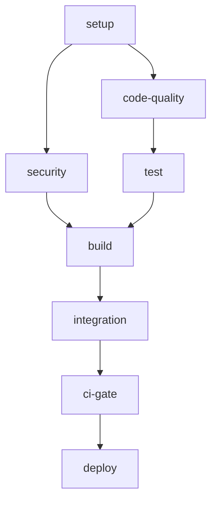

# CI/CD Pipeline Documentation

## Overview

This directory contains the CI/CD pipeline configuration for the day-trade project. The pipeline has been completely refactored and modernized to address all issues identified in #166.

## Main Pipeline

### `main-ci.yml`
The unified, comprehensive CI/CD pipeline that replaces all previous CI configurations.

**Features:**
- 🔍 **Smart Change Detection**: Only runs relevant jobs based on file changes
- 🚀 **Optimized Caching**: Intelligent dependency and tool caching
- 🧪 **Comprehensive Testing**: Multi-version Python support with coverage
- 🔒 **Advanced Security**: Multi-tool security scanning with gating
- 📦 **Robust Building**: Package building with validation
- 🔗 **Enhanced Integration**: Real integration testing
- 📊 **Quality Gates**: Comprehensive quality evaluation

**Trigger Conditions:**
- Push to `main` or `develop` branches
- Pull requests targeting `main` or `develop`
- Manual workflow dispatch

## Composite Actions

Reusable components that eliminate code duplication and improve maintainability:

### `setup-python-env`
Unified Python environment setup with caching and dependency installation.

**Inputs:**
- `python-version`: Python version (default: '3.11')
- `cache-version`: Cache version for dependency management (default: 'v4')
- `install-dependencies`: Install project dependencies (default: 'true')
- `install-dev-dependencies`: Install dev dependencies (default: 'true')
- `install-test-dependencies`: Install test dependencies (default: 'true')

**Outputs:**
- `cache-hit`: Whether dependencies were loaded from cache
- `python-path`: Path to Python executable

### `run-tests`
Comprehensive test execution with coverage and reporting.

**Inputs:**
- `test-type`: Test type - unit, integration, all (default: 'unit')
- `python-version`: Python version for testing (default: '3.11')
- `coverage`: Enable coverage reporting (default: 'false')
- `parallel`: Enable parallel test execution (default: 'true')
- `coverage-threshold`: Minimum coverage threshold (default: '40')

**Outputs:**
- `test-result`: Result of test execution
- `coverage-percentage`: Coverage percentage achieved

### `run-security-scan`
Comprehensive security scanning with multiple tools.

**Inputs:**
- `scan-level`: Security scan level - basic, standard, comprehensive (default: 'standard')
- `fail-on-error`: Whether to fail on security issues (default: 'false')
- `upload-reports`: Whether to upload security reports (default: 'true')

**Outputs:**
- `safety-result`: Result of Safety scan
- `bandit-result`: Result of Bandit scan
- `semgrep-result`: Result of Semgrep scan

## Job Dependencies

## Pipeline Stages

### 1. Setup & Change Detection
- Detects changed files to optimize job execution
- Sets up Python environment with intelligent caching
- Installs dependencies only when needed

### 2. Code Quality
- Runs pre-commit hooks on changed files (PRs) or all files (pushes)
- Uses full git history for proper diff comparison
- Enforces code formatting and linting standards

### 3. Testing
- **Multi-version support**: Tests on Python 3.10, 3.11, 3.12
- **Parallel execution**: Uses pytest-xdist for faster test runs
- **Coverage reporting**: Comprehensive coverage with configurable thresholds
- **Integration testing**: Enhanced integration tests with fallback logic

### 4. Security Scanning
- **Safety**: Dependency vulnerability scanning
- **Bandit**: Static security analysis
- **Semgrep**: Advanced security pattern detection
- **pip-audit**: Additional dependency auditing
- **Security gates**: Fails CI on critical security issues

### 5. Build & Package
- Builds both source and wheel distributions
- Validates package integrity with twine
- Checks package size and warns on large packages
- Uploads build artifacts for later use

### 6. Integration Testing
- Tests actual package installation from built artifacts
- Verifies both wheel and source installations
- Performs basic functionality checks
- Runs only on PRs and main branch pushes

### 7. Quality Gate
- Evaluates overall CI health
- Required jobs must pass, optional jobs can fail with warnings
- Provides comprehensive execution summary
- Gates deployment based on quality metrics

### 8. Deployment
- Triggered only on successful main branch pushes
- Uses production environment protection
- Placeholder for actual deployment logic
- Includes pre-deployment validation

## Improvements Implemented

### ✅ Issues Addressed from #166

1. **Workflow Role Clarification**:
   - Consolidated 3 duplicate CI workflows into 1 unified pipeline
   - Clear job separation and dependencies

2. **Configuration Centralization**:
   - Created reusable composite actions
   - Eliminated YAML duplication
   - Centralized Python and tool setup

3. **Change Detection Enhancement**:
   - Refined path filters with proper granularity
   - Smart job skipping based on changes
   - Proper workflow change detection

4. **fetch-depth Fix**:
   - Uses `fetch-depth: 0` for pre-commit jobs
   - Proper git history for diff operations

5. **Test Coverage Enhancement**:
   - Multi-version Python testing (3.10, 3.11, 3.12)
   - Comprehensive test types (unit, integration)
   - Proper coverage reporting and thresholds

6. **Security Strictness**:
   - Multiple security tools (Safety, Bandit, Semgrep, pip-audit)
   - Configurable failure modes
   - Security gate enforcement

7. **Integration Test Implementation**:
   - Real package installation testing
   - Both wheel and source distribution validation
   - Basic functionality verification

8. **Deployment Logic Framework**:
   - Environment protection setup
   - Pre-deployment validation
   - Staging and production deployment stages

## Performance Optimizations

- **Intelligent Caching**: Multi-level caching strategy
- **Parallel Execution**: Tests run in parallel with pytest-xdist
- **Change-based Skipping**: Jobs skip when no relevant changes
- **Artifact Optimization**: Efficient artifact management
- **Resource Management**: Proper cleanup and retention policies

## Monitoring & Reporting

- **Coverage Reports**: XML, HTML, JSON formats with Codecov integration
- **Security Reports**: Comprehensive security analysis artifacts
- **Test Reports**: Detailed test execution summaries
- **Quality Metrics**: Overall pipeline health reporting
- **Performance Tracking**: Execution time and efficiency metrics

## Legacy Workflows

The following workflows have been disabled (renamed with `.disabled` extension):
- `ci.yml.disabled` - Original optimized CI
- `ci-legacy.yml.disabled` - Legacy CI pipeline  
- `optimized-ci.yml.disabled` - Ultra-fast CI variant

These are preserved for reference but no longer execute.

## Migration Guide

### For Developers
1. The new pipeline automatically detects changes and runs appropriate jobs
2. All previous CI features are maintained or improved
3. New composite actions can be reused in other workflows
4. Security scanning is now more comprehensive

### For DevOps
1. Monitor the `ci-gate` job for overall pipeline health
2. Security gate failures require immediate attention
3. Deployment logic can be implemented in the deploy job
4. Composite actions provide building blocks for additional workflows

## Configuration

### Environment Variables
- `PYTHON_VERSION`: Default Python version (3.11)
- `CACHE_VERSION`: Cache version for invalidation (v4)
- `PYTHONDONTWRITEBYTECODE`: Optimize Python execution
- `PYTHONUNBUFFERED`: Improve logging output

### Secrets Required
- `CODECOV_TOKEN`: For coverage reporting (optional)
- Additional secrets for deployment (to be configured)

## Troubleshooting

### Common Issues
1. **Cache misses**: Check if dependencies changed
2. **Test failures**: Review test logs and coverage reports
3. **Security failures**: Address flagged vulnerabilities immediately
4. **Build failures**: Verify package configuration

### Debug Steps
1. Check change detection outputs in setup job
2. Review composite action outputs
3. Examine artifact uploads for detailed reports
4. Use workflow dispatch for manual testing

## Future Enhancements

1. **Performance Monitoring**: Add execution time tracking
2. **Matrix Expansion**: Support additional Python versions
3. **Platform Testing**: Add Windows/macOS runners
4. **Deployment**: Implement actual deployment logic
5. **Notifications**: Add Slack/Teams integration
