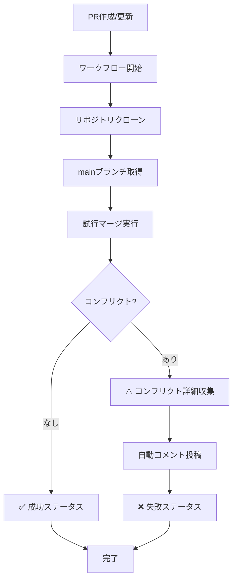

# 🔍 Enhanced CI コンフリクト検知システム

プルリクエストのマージコンフリクトを高精度で自動検知する拡張CI/CDシステムです。

## 🚀 機能概要

### ✨ 主な機能
- **🎯 高精度検知**: 複数の検知手法による確実なコンフリクト発見
- **📊 マージ複雑度分析**: 変更の重複度合いを自動評価
- **📝 詳細レポート**: コンフリクトファイルの特定と段階的解決手順
- **🔄 リアルタイム更新**: PR更新時の自動再検知
- **📋 包括的ガイド**: rebase/mergeの両方の解決方法を提示

### 🎯 解決する課題
- マージ時のコンフリクト発見の遅れ
- 開発者間の作業競合
- レビューアーの作業負荷軽減
- CI/CDパイプラインの効率化

## 📁 実装ファイル

```
.github/
├── workflows/
│   └── conflict-detection.yml    # メインワークフロー
└── CONFLICT_DETECTION.md         # 詳細ドキュメント

scripts/
└── check-conflicts.sh            # ローカル事前チェックスクリプト

README_CONFLICT_DETECTION.md      # このファイル
```

## 🔧 使用方法

### 自動実行（推奨）
プルリクエストを作成・更新すると自動的に実行されます。

### 手動実行
```bash
# GitHub Actions上で手動実行
gh workflow run conflict-detection.yml

# ローカルで事前チェック
./scripts/check-conflicts.sh
./scripts/check-conflicts.sh develop  # 対象ブランチ指定
```

## 🔍 動作フロー



## 📝 自動コメント例

コンフリクトが検知されると、以下のようなコメントが自動投稿されます：

```markdown
## ⚠️ Merge Conflicts Detected

このプルリクエストは現在mainブランチとの間でコンフリクトが発生しています。

### 📁 コンフリクトが発生しているファイル:
- `src/day_trade/core/trade_manager.py`
- `tests/test_trade_manager.py`

### 🔧 解決方法:
1. ローカルでmainブランチを最新にプル
2. フィーチャーブランチにマージ
3. コンフリクトを手動で解決
4. プルリクエストを更新

### 📊 次のステップ:
- [ ] コンフリクトを解決
- [ ] テストが通ることを確認
- [ ] プルリクエストを更新
```

## ⚙️ カスタマイズ

### 対象ブランチの変更
```yaml
# .github/workflows/conflict-detection.yml
git fetch origin develop:develop  # mainからdevelopに変更
```

### 除外ファイルの設定
```yaml
# 自動生成ファイルなどを除外
git reset HEAD -- docs/api.md
git checkout -- docs/api.md
```

### コメント内容の変更
```yaml
# GitHub Script内のbody変数を編集
const body = `カスタムメッセージ...`;
```

## 🛡️ セキュリティ

- **権限**: 読み取り専用でコンフリクト検知のみ実行
- **トークン**: デフォルトの`GITHUB_TOKEN`を使用
- **分離**: テンポラリブランチでの安全なテスト実行

## 📊 メリット

### 開発者向け
- ✅ 早期のコンフリクト発見
- ✅ 明確な解決手順の提示
- ✅ 作業効率の向上

### レビューアー向け
- ✅ レビュー前のコンフリクト解決
- ✅ 品質の高いPRの受領
- ✅ レビュー時間の短縮

### チーム向け
- ✅ 統一されたコンフリクト解決フロー
- ✅ CI/CDパイプラインの安定化
- ✅ 開発速度の向上

## 🔧 トラブルシューティング

### よくある問題

#### 1. ワークフローが実行されない
```bash
# Actions有効化確認
gh api repos/OWNER/REPO/actions/permissions

# ブランチ保護ルール確認
gh api repos/OWNER/REPO/branches/main/protection
```

#### 2. 権限エラー
```yaml
# permissions設定追加
permissions:
  contents: read
  pull-requests: write
  statuses: write
```

#### 3. 誤検知
```bash
# .gitignoreの確認
git check-ignore -v suspicious-file.txt

# バイナリファイルの除外
git config --global core.autocrlf true
```

## 📈 今後の拡張予定

- 📧 Slack/Teams通知機能
- 📊 コンフリクト統計レポート
- 🤖 自動解決ボット（simple conflicts）
- 🔄 定期的なヘルスチェック

## 🤝 コントリビューション

改善提案やバグ報告は Issue または Pull Request でお願いします。

## 📚 関連ドキュメント

- [詳細ドキュメント](.github/CONFLICT_DETECTION.md)
- [GitHub Actions公式ドキュメント](https://docs.github.com/actions)
- [Git Merge Conflicts解決ガイド](https://docs.github.com/en/github/collaborating-with-pull-requests/addressing-merge-conflicts)

---

🤖 **自動生成**: このシステムにより、開発チームの生産性向上とコード品質の維持を実現します。
